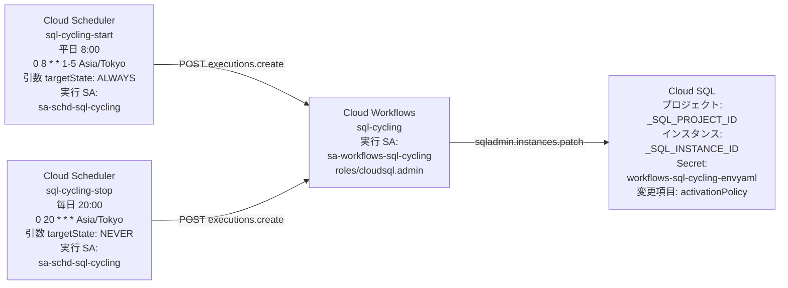

# 定期的に Cloud SQL Instance を起動・停止するサンプル

```mermaid
%%{init: {"flowchart": {"htmlLabels": false, "wrappingWidth": 300, "nodeSpacing": 60, "rankSpacing": 80}}}%%
flowchart LR
  startJob["Cloud Scheduler<br/>sql-cycling-start<br/>平日 8:00<br/>0 8 * * 1-5 Asia/Tokyo<br/>引数 targetState: ALWAYS<br/>実行 SA:<br/>sa-schd-sql-cycling"]
  stopJob["Cloud Scheduler<br/>sql-cycling-stop<br/>毎日 20:00<br/>0 20 * * * Asia/Tokyo<br/>引数 targetState: NEVER<br/>実行 SA:<br/>sa-schd-sql-cycling"]
  workflow["Cloud Workflows<br/>sql-cycling<br/>実行 SA:<br/>sa-workflows-sql-cycling<br/>roles/cloudsql.admin"]
  sql["Cloud SQL<br/>プロジェクト:<br/>_SQL_PROJECT_ID<br/>インスタンス:<br/>_SQL_INSTANCE_ID<br/>Secret:<br/>workflows-sql-cycling-envyaml<br/>変更項目: activationPolicy"]

  startJob -->|"POST executions.create"| workflow
  stopJob -->|"POST executions.create"| workflow
  workflow -->|"sqladmin.instances.patch"| sql
```

詳細は Cloud SQL のところにあります -> [定期的に Cloud SQL Instance を起動・停止するサンプル](../../sql/samples-periodically-starting-and-stopping/scheduler-workflows-sql/)
